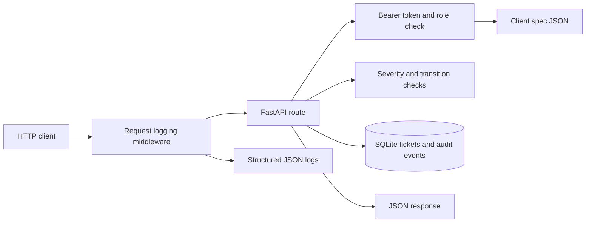

# AlertDesk architecture

## Scope

AlertDesk is a small FastAPI service for creating, assigning, listing, retrieving,
and transitioning security tickets. The client workflow is supplied through
`config/client-spec.json`; the application reads the spec when it authenticates
each request. The database stores ticket records and audit events, while status
and role rules remain configuration data.

## Request path

1. The request logging middleware records method, path, response status, and
   elapsed time. It does not record headers, tokens, query strings, bodies, or
   ticket contents.
2. Protected routes resolve a bearer token against the spec and check whether
   its role permits the requested action. The health route is public.
3. Ticket routes validate severity or transition rules against the same spec.
   Ticket data and audit events are stored in SQLite.
4. The service returns JSON. FastAPI exposes the generated OpenAPI document at
   `/openapi.json` and interactive API documentation at `/docs`.

## Components

- `alertdesk/app.py` defines the FastAPI application, request models, route
  handlers, and database operations.
- `alertdesk/auth.py` loads the current client spec, resolves the stub bearer
  token, and enforces role permissions.
- `alertdesk/spec.py` reads the JSON spec and evaluates token, role, and
  transition rules.
- `alertdesk/db.py` opens SQLite connections and creates the generic ticket
  and audit tables. The schema stores status as text so new client statuses do
  not require a database enum or migration.
- `alertdesk/observability.py` configures structured HTTP request logging.
- `config/client-spec.json` defines severities, initial status, statuses,
  permitted transitions, roles, and lab tokens.

## Data and workflow

A ticket contains its title, description, severity, current status, optional
assignee, creator role, and creation time. Each create, assign, and transition
operation also inserts an audit event with the actor, action, detail, and time.
The application writes audit events on these operations; SQLite does not
currently enforce append-only access at the database level.

A transition is accepted only when its target appears in the current status's
allowed transition list. Client workflow changes therefore belong in the
specification and its contract tests. Ticket status is stored as text, so a
new status does not require a schema change.

## Runtime and operations

The app initializes the SQLite schema during startup. By default the database
is `data/alertdesk.sqlite`; `ALERTDESK_DB` selects another path. The spec
defaults to `config/client-spec.json`; `ALERTDESK_SPEC` selects another JSON
file. These settings support isolated test data and client-specific
configuration.

Logs are emitted as compact JSON to the application process's standard error
stream. The current service uses a local SQLite database and stub bearer tokens;
the tokens are for the scaffold only and are not production authentication.
The service has no external connector, distributed database, or background job
system.

## Boundaries and follow-up

- Replace stub token authentication before production use and protect secrets
  through deployment configuration.
- Back up and persist the SQLite data directory when deploying; the current
  repository does not define a production deployment.
- Keep the runtime spec and contract tests aligned when the client changes its
  workflow or permissions.
- Review audit retention and database-level tamper resistance before treating
  audit records as a compliance control.
